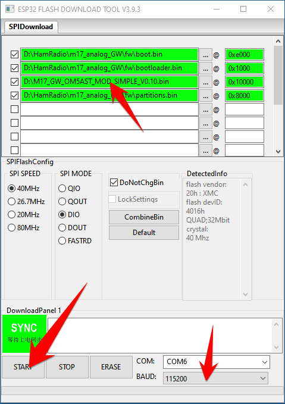

# Info And Disclaimer

I take no responsibility for any damage or improper use of this project. M17-related stuff is intended for experienced users and if you think that you are missing some important info, feel free to visit (https://m17project.org/) or ask on official M17 community channels (https://m17project.org/get-started/community).

This fork has been created only for my testing/educational purposes and is not intended as an in-place full replacement of perfect original work by Atten (https://github.com/nakhonthai/M17AnalogGateway) - thanks Atten, you did a great piece of work.

This fork is not regularly supported and consists of features that I need therefore it is not an exact compatible copy of the original. I will backport time-by-time some fixes and features from the original project but only on a non-regular basis. Libraries used in this project are mostly edge versions available, there is no compatibility with the original source code by Atten. Anyway, most of this fork is a copy of the original project with some minor or significant changes.

Thanks, friends for understanding and have fun with M17.

VY 73 by OM5AST

# M17 Analog Hotspot Gateway Project

How to Make digital voice radio (M17 Digital Voice) analog gateway yourself over the internet width ESP32 NodeMCU/DOIT/DevKIT Module.
The project made M17AnalogGateway convert digital voice with M17 mode to Analog Radio.

## Features

* supported hardware: ESP32 module
* almost any analog FM transceiver (Tested with Baofeng UV5R)
* using ESP-Arduino development on Visual studio code IDE
* support M17 mref reflector
* support noise cancel
* support AGC
* using USB serial for host connection and power supply
* support Wi-Fi connection (UDP) to Reflector
* support Web Service config and control system
* display received and transmit a packet on the LED
* display information on OLED display

## ESP32DR Simple

ESP32DR Simple Circut is a small interface board for connecting to a transceiver.

* PCB size is 64x58mm
* PCB Single size
* RJ11 6 Pin out to Radio (or use DuPont wire pins)

### Schematic

### Problems and HowTo
- TODO: VOX circuit 
- TODO: debug via serial port
- TODO: do not combine AP + STA mode on wifi

### CAD data
 
- The gerber data is [here](doc/Gerber_ESP32DR_Simple.zip)
- The PCB film positive is [here](doc/PCB_Bottom.pdf)
- The PCB film negative is [here](doc/PCB_Bottom_Invert.pdf)
- The PCB Layout is [here](doc/PCB_Layout.pdf)
- The Schematic PDF is [here](doc/ESP32DR_Simple_Schematic.pdf)

### BOM list  

|Reference|Value|Description|
|---|:---:|---|
|U1|ESP32 DEVKIT|DOIT ESP32 DEVKIT (โมดูล ESP32)|
|RP2|10K|VR 3362W (R sound output)|
|RP1|10K|VR 3362W (R sound input)|
|RJ11|RJ11-6P6C| RJ11 or dupont pins|
|R13,R12,R11,R5,R3,R9|1K|R 1K 1/4W |
|R7,R18,R19|100R|R 100R  1/4W |
|R6,R2,R1|10K|R 10k  1/4W |
|R4|3K|R 3k 1/4W |
|R10|33K|R 33K 1/4W |
|Q1|2N3904| TUN/NPN (TO-92)|
|LED3|LED 3.5mm|TX|
|LED2|LED 3.5mm|RX|
|LED1|LED 3.5mm|Power|
|L1|L or JMP|L Isolate or Jumper|
|C11|100uF/6.3V|Ellyt|
|C4,C5|100nF|Ceramic|
|C6|470uF/10V|Ellyt|
|C1,C3,C10|100nF or 0.1uF|Polypropylene/Ceramic|
|C2|10nF or 0.01uF|Polypropylene/Ceramic|
|D2,D1|1N4148|or use C 0.01uF instead of|

### Mounting drawing

### Transceiver connection

A solder jumper is needed depending on the transceiver.

|Manufacture|RJ11-1 (+VIN)|RJ11-2 (SPK)|RJ11-3 (PTT)|RJ11-4 (GND)|RJ11-5 (MIC)|RJ11-6 (SQL)|
|---|---|---|---|---|---|---|
|Alinco DR-135(DB9)|-|2|7|5|9|1|
|IC2200(RJ45)|-|SP|4|5|6|-|
|FT-2800(RJ11)|-|SP|1|3|2|-|
|HT Mic Cable|-|SPK|PTT|GND|MIC|-|

for Alinco DR-135(DB9)

for ICOM IC2200(RJ45)

for Yaesu FT-2800(RJ11)

for Handheld (Baofeng UV5R or similar)

## Howto Develop
- Pull and Compile by PlatformIO on the Visual Studio Code.

## M17AG firmware installation
1. Connect the USB cable to the ESP32 Module.
2. Download firmware and open the program `ESP32 DOWNLOAD TOOL`, set it in the firmware upload program, and set the firmware to `M17_GW_OM5AST_MOD_SIMPLE_*.bin`, location 0x10000 and partitions.bin at 0x8000 and bootloader.bin at 0x1000 and boot.bin at 0xe000. Push the `START` button and hold a few seconds `BOOT` button on your ESP board. Wait for a finish, then reset the ESP board. You can see the state of the module via the serial terminal at `115200bps, 8N1, no-handshake`
3. Go to WiFi AP SSID: `M17AnalogGW` with no password and open a browser to the website http://192.168.4.1 
4. Then change settings according to your needs
5. Push the `BOOT` button after TX and RX led glows for more than 3s to Factory Default - only if you need
6. If you need to reboot the device, press shortly `EN` on the ESP board

## HowTo Flash

### ESP32 Flash Download Tools

- Download from https://www.espressif.com/en/support/download/other-tools
- How-To flash - see example below with firmware installation instructions

## HowTo Setup
- TODO: screenshots of the setup

## List of M17 reflectors
- https://reflectors.m17.link/ref-list

## Some English/German/International reflectors to try out

	Name: M17-M17
	IP: 152.70.192.70
	PORT: 17000
	Dashboard: https://ref.m17.link/

	Name: M17-AUT
	IP: 195.26.215.5
	PORT: 17000
	Dashboard: https://m17-aut.xreflector.net/

	Name: M17-FUR
	IP: 45.76.29.81
	PORT: 17000
	Dashboard: https://ord1.w3fur.radio:17000/

	Name: M17-FOG
	IP: 95.179.203.54
	PORT: 17000
	Dashboard: https://m17.ham-radio-fog.org/index.php

	Name: M17-NWR
	IP: 159.242.127.220	
	PORT: 17000
	Dashboard: https://m17.nwrg.org.uk/
